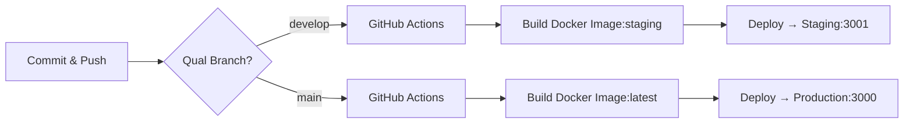

# Guia de Verificação de Versões - HallyuHub

Este documento fornece instruções detalhadas e scripts para verificar se a versão local está coerente com as versões nos servidores de homologação (staging) e produção.

## Ambientes do Projeto

| Ambiente | URL | Branch Git | Localização Servidor |
|----------|-----|------------|---------------------|
| **Local** | http://localhost:3000 | (qualquer) | Sua máquina |
| **Staging** | http://31.97.255.107:3001 | develop | /var/www/hallyuhub |
| **Production** | http://31.97.255.107:3000 | main | /var/www/hallyuhub |

---

## 1. Verificação Rápida de Versões

### Script 1: Verificar Versão Local

```bash
#!/bin/bash
# check-local-version.sh

echo "=== VERSÃO LOCAL ==="
echo ""
echo "📦 Package.json:"
cat v1/package.json | grep '"version"'
echo ""
echo "🌿 Git branch atual:"
git branch --show-current
echo ""
echo "📝 Último commit:"
git log -1 --oneline
echo ""
echo "🔄 Git status:"
git status --short
```

**Como usar:**
```bash
chmod +x check-local-version.sh
./check-local-version.sh
```

---

### Script 2: Verificar Versão em Staging

```bash
#!/bin/bash
# check-staging-version.sh

echo "=== VERSÃO EM STAGING ==="
echo ""
echo "🌐 URL: http://31.97.255.107:3001"
echo ""

# Verifica se o endpoint de health está respondendo
echo "📊 Health check:"
curl -s http://31.97.255.107:3001/api/health | jq . 2>/dev/null || echo "Endpoint não disponível ou sem jq instalado"
echo ""

# Versão esperada (branch develop)
echo "🌿 Branch esperada: develop"
echo ""
echo "📝 Último commit em develop:"
git log develop -1 --oneline
echo ""

# Se tiver acesso SSH configurado
echo "🔍 Para verificar a imagem Docker em staging:"
echo "   ssh [seu-usuario]@31.97.255.107 'docker ps | grep hallyuhub'"
```

**Como usar:**
```bash
chmod +x check-staging-version.sh
./check-staging-version.sh
```

---

### Script 3: Verificar Versão em Produção

```bash
#!/bin/bash
# check-production-version.sh

echo "=== VERSÃO EM PRODUÇÃO ==="
echo ""
echo "🌐 URL: http://31.97.255.107:3000"
echo ""

# Verifica se o endpoint de health está respondendo
echo "📊 Health check:"
curl -s http://31.97.255.107:3000/api/health | jq . 2>/dev/null || echo "Endpoint não disponível ou sem jq instalado"
echo ""

# Versão esperada (branch main)
echo "🌿 Branch esperada: main"
echo ""
echo "📝 Último commit em main:"
git log main -1 --online
echo ""

# Se tiver acesso SSH configurado
echo "🔍 Para verificar a imagem Docker em produção:"
echo "   ssh [seu-usuario]@31.97.255.107 'docker ps | grep hallyuhub'"
```

**Como usar:**
```bash
chmod +x check-production-version.sh
./check-production-version.sh
```

---

## 2. Verificação Completa (Todos os Ambientes)

### Script Unificado: Verificar Todas as Versões

```bash
#!/bin/bash
# check-all-versions.sh

set -e

echo "╔════════════════════════════════════════════════════════════╗"
echo "║     VERIFICAÇÃO DE VERSÕES - HALLYUHUB                    ║"
echo "╚════════════════════════════════════════════════════════════╝"
echo ""

# Cores para output
GREEN='\033[0;32m'
YELLOW='\033[1;33m'
RED='\033[0;31m'
NC='\033[0m' # No Color

# ========== LOCAL ==========
echo "━━━━━━━━━━━━━━━━━━━━━━━━━━━━━━━━━━━━━━━━━━━━━━━━━━━━━━━━━━"
echo "📍 AMBIENTE LOCAL"
echo "━━━━━━━━━━━━━━━━━━━━━━━━━━━━━━━━━━━━━━━━━━━━━━━━━━━━━━━━━━"

LOCAL_VERSION=$(cat v1/package.json | grep '"version"' | sed 's/.*: "\(.*\)".*/\1/')
LOCAL_BRANCH=$(git branch --show-current)
LOCAL_COMMIT=$(git log -1 --format="%h - %s" | head -c 60)
LOCAL_STATUS=$(git status --short | wc -l | tr -d ' ')

echo "   Versão package.json: ${GREEN}${LOCAL_VERSION}${NC}"
echo "   Branch atual:        ${YELLOW}${LOCAL_BRANCH}${NC}"
echo "   Último commit:       ${LOCAL_COMMIT}"
echo "   Arquivos modificados: ${LOCAL_STATUS}"
echo ""

# ========== STAGING ==========
echo "━━━━━━━━━━━━━━━━━━━━━━━━━━━━━━━━━━━━━━━━━━━━━━━━━━━━━━━━━━"
echo "🧪 AMBIENTE STAGING (HOMOLOGAÇÃO)"
echo "━━━━━━━━━━━━━━━━━━━━━━━━━━━━━━━━━━━━━━━━━━━━━━━━━━━━━━━━━━"

STAGING_URL="http://31.97.255.107:3001"
STAGING_BRANCH="develop"
STAGING_COMMIT=$(git log ${STAGING_BRANCH} -1 --format="%h - %s" 2>/dev/null | head -c 60 || echo "Branch não encontrada")

echo "   URL:                 ${STAGING_URL}"
echo "   Branch esperada:     ${YELLOW}${STAGING_BRANCH}${NC}"
echo "   Último commit:       ${STAGING_COMMIT}"

# Tenta fazer health check
if command -v curl &> /dev/null; then
    STAGING_HEALTH=$(curl -s -o /dev/null -w "%{http_code}" ${STAGING_URL}/api/health 2>/dev/null || echo "000")
    if [ "$STAGING_HEALTH" = "200" ]; then
        echo "   Status:              ${GREEN}✓ Online (HTTP $STAGING_HEALTH)${NC}"
    else
        echo "   Status:              ${RED}✗ Offline ou erro (HTTP $STAGING_HEALTH)${NC}"
    fi
else
    echo "   Status:              ⚠ curl não instalado - não foi possível verificar"
fi
echo ""

# ========== PRODUCTION ==========
echo "━━━━━━━━━━━━━━━━━━━━━━━━━━━━━━━━━━━━━━━━━━━━━━━━━━━━━━━━━━"
echo "🚀 AMBIENTE PRODUCTION (PRODUÇÃO)"
echo "━━━━━━━━━━━━━━━━━━━━━━━━━━━━━━━━━━━━━━━━━━━━━━━━━━━━━━━━━━"

PROD_URL="http://31.97.255.107:3000"
PROD_BRANCH="main"
PROD_COMMIT=$(git log ${PROD_BRANCH} -1 --format="%h - %s" 2>/dev/null | head -c 60 || echo "Branch não encontrada")

echo "   URL:                 ${PROD_URL}"
echo "   Branch esperada:     ${YELLOW}${PROD_BRANCH}${NC}"
echo "   Último commit:       ${PROD_COMMIT}"

# Tenta fazer health check
if command -v curl &> /dev/null; then
    PROD_HEALTH=$(curl -s -o /dev/null -w "%{http_code}" ${PROD_URL}/api/health 2>/dev/null || echo "000")
    if [ "$PROD_HEALTH" = "200" ]; then
        echo "   Status:              ${GREEN}✓ Online (HTTP $PROD_HEALTH)${NC}"
    else
        echo "   Status:              ${RED}✗ Offline ou erro (HTTP $PROD_HEALTH)${NC}"
    fi
else
    echo "   Status:              ⚠ curl não instalado - não foi possível verificar"
fi
echo ""

# ========== COMPARAÇÃO ==========
echo "━━━━━━━━━━━━━━━━━━━━━━━━━━━━━━━━━━━━━━━━━━━━━━━━━━━━━━━━━━"
echo "🔍 ANÁLISE DE CONSISTÊNCIA"
echo "━━━━━━━━━━━━━━━━━━━━━━━━━━━━━━━━━━━━━━━━━━━━━━━━━━━━━━━━━━"

# Verifica se local está sincronizado com main
if [ "$LOCAL_BRANCH" = "main" ]; then
    DIFF_MAIN=$(git rev-list --count main...HEAD 2>/dev/null || echo "0")
    if [ "$DIFF_MAIN" -eq 0 ]; then
        echo "   ${GREEN}✓${NC} Local está sincronizado com main (produção)"
    else
        echo "   ${YELLOW}⚠${NC} Local tem $DIFF_MAIN commits diferentes de main"
    fi
fi

# Verifica se local está sincronizado com develop
if [ "$LOCAL_BRANCH" = "develop" ]; then
    DIFF_DEVELOP=$(git rev-list --count develop...HEAD 2>/dev/null || echo "0")
    if [ "$DIFF_DEVELOP" -eq 0 ]; then
        echo "   ${GREEN}✓${NC} Local está sincronizado com develop (staging)"
    else
        echo "   ${YELLOW}⚠${NC} Local tem $DIFF_DEVELOP commits diferentes de develop"
    fi
fi

# Verifica se há mudanças não commitadas
if [ "$LOCAL_STATUS" -gt 0 ]; then
    echo "   ${YELLOW}⚠${NC} Existem $LOCAL_STATUS arquivo(s) modificado(s) localmente"
else
    echo "   ${GREEN}✓${NC} Não há mudanças locais não commitadas"
fi

# Verifica diferenças entre main e develop
DIFF_BRANCHES=$(git rev-list --count main...develop 2>/dev/null || echo "0")
if [ "$DIFF_BRANCHES" -eq 0 ]; then
    echo "   ${GREEN}✓${NC} main e develop estão sincronizadas"
else
    echo "   ${YELLOW}⚠${NC} Existem $DIFF_BRANCHES commits de diferença entre main e develop"
    echo "      Execute: git log main...develop --oneline"
fi

echo ""
echo "━━━━━━━━━━━━━━━━━━━━━━━━━━━━━━━━━━━━━━━━━━━━━━━━━━━━━━━━━━"
echo ""
```

**Como usar:**
```bash
chmod +x check-all-versions.sh
./check-all-versions.sh
```

---

## 3. Verificação no Servidor (SSH)

Se você tiver acesso SSH ao servidor, pode verificar diretamente qual versão está rodando:

### Script 4: Verificar Versão no Servidor via SSH

```bash
#!/bin/bash
# check-server-versions.sh

# IMPORTANTE: Configure seu usuário SSH antes de usar
SSH_USER="seu-usuario"  # ← ALTERE AQUI
SSH_HOST="31.97.255.107"

echo "=== VERIFICANDO VERSÕES NO SERVIDOR ==="
echo ""

# Verifica se a conexão SSH está configurada
if ! ssh -o BatchMode=yes -o ConnectTimeout=5 ${SSH_USER}@${SSH_HOST} exit 2>/dev/null; then
    echo "❌ Erro: Não foi possível conectar via SSH"
    echo "   Configure sua chave SSH primeiro ou verifique suas credenciais"
    echo ""
    echo "   Passos para configurar SSH:"
    echo "   1. ssh-keygen -t ed25519 -C 'seu-email@example.com'"
    echo "   2. ssh-copy-id ${SSH_USER}@${SSH_HOST}"
    exit 1
fi

echo "✅ Conexão SSH OK"
echo ""

# Verifica containers Docker rodando
echo "📦 Containers Docker em execução:"
ssh ${SSH_USER}@${SSH_HOST} << 'ENDSSH'
    docker ps --format "table {{.Names}}\t{{.Image}}\t{{.Status}}\t{{.Ports}}" | grep -E "NAME|hallyuhub"
ENDSSH
echo ""

# Verifica imagens Docker disponíveis
echo "🖼️  Imagens Docker disponíveis:"
ssh ${SSH_USER}@${SSH_HOST} << 'ENDSSH'
    docker images | grep -E "REPOSITORY|khub"
ENDSSH
echo ""

# Verifica último deploy
echo "📅 Último deploy (baseado em timestamp dos containers):"
ssh ${SSH_USER}@${SSH_HOST} << 'ENDSSH'
    docker ps --format "{{.Names}}: Criado {{.CreatedAt}}" | grep hallyuhub
ENDSSH
echo ""

# Verifica logs recentes
echo "📋 Últimas 10 linhas de log (produção):"
ssh ${SSH_USER}@${SSH_HOST} << 'ENDSSH'
    docker logs hallyuhub --tail 10 2>&1 || echo "Container 'hallyuhub' não encontrado"
ENDSSH
echo ""
```

**Como usar:**
```bash
# Primeiro, edite o script e configure seu SSH_USER
nano check-server-versions.sh

# Depois execute:
chmod +x check-server-versions.sh
./check-server-versions.sh
```

---

## 4. Workflow de Deploy

### Como funciona o deploy automático:



### Verificar última execução do GitHub Actions:

```bash
# Instale gh CLI se ainda não tiver:
# brew install gh (MacOS)
# ou veja: https://cli.github.com/

# Listar últimas execuções do workflow
gh run list --workflow=deploy-image.yml --limit 5

# Ver detalhes de uma execução específica
gh run view [RUN_ID]

# Ver logs de uma execução
gh run view [RUN_ID] --log
```

---

## 5. Checklist de Verificação Manual

Use este checklist para garantir que tudo está sincronizado:

### ✅ Checklist Pré-Deploy

- [ ] **Local sincronizado com Git**
  ```bash
  git status
  # Deve mostrar: "nothing to commit, working tree clean"
  ```

- [ ] **Branch correta**
  ```bash
  git branch --show-current
  # develop → vai para staging
  # main → vai para produção
  ```

- [ ] **Versão no package.json atualizada** (se aplicável)
  ```bash
  cat v1/package.json | grep version
  ```

- [ ] **Testes passando** (se houver)
  ```bash
  cd v1 && npm test
  ```

- [ ] **Build local funcionando**
  ```bash
  cd v1 && npm run build
  ```

### ✅ Checklist Pós-Deploy

- [ ] **GitHub Actions rodou com sucesso**
  ```bash
  gh run list --workflow=deploy-image.yml --limit 1
  ```

- [ ] **Endpoint de health respondendo**
  ```bash
  # Staging
  curl http://31.97.255.107:3001/api/health

  # Production
  curl http://31.97.255.107:3000/api/health
  ```

- [ ] **Verificar logs no servidor** (via SSH ou Docker)
  ```bash
  ssh usuario@31.97.255.107 "docker logs hallyuhub --tail 50"
  ```

- [ ] **Teste manual no navegador**
  - Staging: http://31.97.255.107:3001
  - Production: http://31.97.255.107:3000

---

## 6. Comandos Úteis

### Git

```bash
# Ver diferenças entre branches
git diff main develop

# Ver commits que estão em develop mas não em main
git log main..develop --oneline

# Ver commits que estão em main mas não em develop
git log develop..main --oneline

# Sincronizar sua branch local com remote
git fetch origin
git pull origin main
```

### Docker (no servidor via SSH)

```bash
# Ver containers rodando
docker ps

# Ver logs de um container
docker logs hallyuhub --tail 100 -f

# Acessar shell dentro do container
docker exec -it hallyuhub sh

# Verificar versão da imagem
docker inspect hallyuhub | grep -A 5 "Image"

# Ver uso de recursos
docker stats hallyuhub --no-stream
```

### Health Checks

```bash
# Verificar se staging está online
curl -I http://31.97.255.107:3001/api/health

# Verificar se production está online
curl -I http://31.97.255.107:3000/api/health

# Verificar tempo de resposta
curl -o /dev/null -s -w "Tempo: %{time_total}s\n" http://31.97.255.107:3000/api/health
```

---

## 7. Troubleshooting

### Problema: Versões divergentes entre ambientes

**Solução:**
```bash
# 1. Verifique qual commit está em cada ambiente
./check-all-versions.sh

# 2. Se precisar forçar novo deploy:
# Para staging (develop):
git checkout develop
git pull origin develop
git push origin develop  # Isso vai triggar o CI/CD

# Para production (main):
git checkout main
git pull origin main
git push origin main  # Isso vai triggar o CI/CD
```

### Problema: GitHub Actions não executou

**Solução:**
```bash
# Verificar status do último workflow
gh run list --workflow=deploy-image.yml --limit 3

# Re-executar manualmente se necessário
gh workflow run deploy-image.yml --ref main
```

### Problema: Container não está respondendo no servidor

**Solução via SSH:**
```bash
ssh usuario@31.97.255.107

# Verificar se container está rodando
docker ps | grep hallyuhub

# Se não estiver, verificar logs
docker logs hallyuhub --tail 100

# Reiniciar container
cd /var/www/hallyuhub
docker-compose restart hallyuhub

# Verificar novamente
docker ps | grep hallyuhub
```

---

## 8. Referências Rápidas

### URLs dos Ambientes
- **Local**: http://localhost:3000
- **Staging**: http://31.97.255.107:3001
- **Production**: http://31.97.255.107:3000

### Branches
- **develop** → Staging (homologação)
- **main** → Production (produção)

### Caminhos no Servidor
- **Base**: `/var/www/hallyuhub`
- **Docker Compose**: `/var/www/hallyuhub/docker-compose*.yml`
- **Logs**: `docker logs hallyuhub`

### Registry de Imagens
- **GitHub Container Registry**: `ghcr.io/uchidate/khub`
- **Tags**: `latest` (production), `staging`, `sha-<commit>`

---

## Conclusão

Use os scripts fornecidos neste documento para manter controle sobre as versões em todos os ambientes. Recomenda-se executar `check-all-versions.sh` antes e depois de cada deploy importante.

**Próximos passos sugeridos:**
1. Salve todos os scripts em uma pasta `scripts/` no projeto
2. Adicione permissões de execução: `chmod +x scripts/*.sh`
3. Execute o script completo: `./scripts/check-all-versions.sh`
4. Configure seu acesso SSH para usar o script de verificação no servidor
