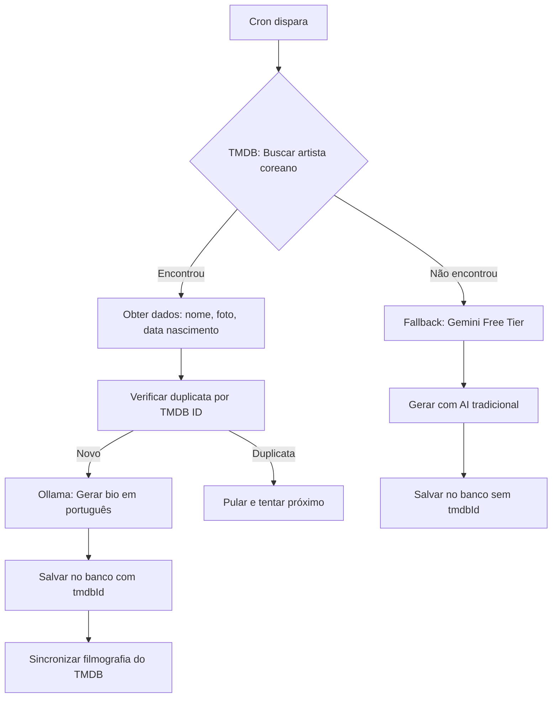

# 🎯 Estratégia TMDB: Artistas Reais com Custo Zero

## 📊 Resumo da Nova Abordagem

Este documento explica a **nova estratégia de geração de conteúdo** focada em **artistas REAIS** e **custo zero**.

### Antes (❌ Problema)
- ❌ AI gerava artistas falsos/inventados
- ❌ Desperdício de API calls em dados inventados
- ❌ Risco de duplicatas
- ❌ Imagens genéricas do Unsplash
- ❌ Sem filmografia real

### Agora (✅ Solução)
- ✅ **Artistas reais** do TMDB (base de dados de cinema/TV)
- ✅ **Fotos reais** dos artistas via TMDB
- ✅ **Filmografia completa** automaticamente sincronizada
- ✅ **Bio em português** gerada pelo Ollama (gratuito)
- ✅ **Verificação de duplicatas** via TMDB ID
- ✅ **Custo zero** (TMDB gratuito + Ollama local)

---

## 🔄 Como Funciona Agora

### Fluxo de Geração de Artistas



### Fontes de Dados por Campo

| Campo | Fonte Primária | Fallback | Custo |
|-------|---------------|----------|-------|
| Nome (romanizado) | TMDB API | Gemini Free Tier | $0 |
| Foto | TMDB Images | Unsplash | $0 |
| Data de nascimento | TMDB API | Gemini Free Tier | $0 |
| Filmografia | TMDB Combined Credits | N/A | $0 |
| Bio em português | Ollama (local) | Bio simples | $0 |
| Nome em hangul | N/A (não no TMDB) | Gemini Free Tier | $0 |
| Agência | N/A (não no TMDB) | Gemini Free Tier | $0 |

---

## 💰 Economia de Custos

### Antes vs Agora

| Operação | Antes | Agora | Economia |
|----------|-------|-------|----------|
| Dados do artista | Gemini/OpenAI (~$0.02) | TMDB ($0) | 100% |
| Foto | Unsplash genérico | TMDB real ($0) | - |
| Bio | Gemini/OpenAI (~$0.005) | Ollama ($0) | 100% |
| Filmografia | Sync separado | Incluído no TMDB ($0) | - |
| **Total por artista** | **~$0.025** | **$0.00** | **100%** |

### Projeção Mensal

Com cron a cada 15 minutos (2 artistas por execução):

| Período | Artistas | Custo Antes | Custo Agora | Economia |
|---------|----------|-------------|-------------|----------|
| 1 hora | 8 | $0.20 | $0.00 | $0.20 |
| 1 dia | ~190 | $4.75 | $0.00 | $4.75 |
| 1 mês | ~5,700 | $142.50 | $0.00 | **$142.50** |

**Economia anual: ~$1,710** 💰

---

## 🎬 Base de Artistas do TMDB

### Artistas Pré-Configurados

O sistema possui uma lista de **100+ artistas coreanos populares**:

**Atores/Atrizes:**
- Song Joong-ki, Park Seo-joon, Lee Min-ho, Kim Soo-hyun
- Hyun Bin, Lee Jong-suk, Ji Chang-wook, Nam Joo-hyuk
- IU, Bae Suzy, Jun Ji-hyun, Song Hye-kyo, Han So-hee
- Kim Go-eun, Shin Min-a, Park Min-young, Kim Ji-won
- E mais 80+ artistas...

**Idols que atuam:**
- BTS: V, Jin, Jimin, Jungkook, RM, Suga, J-Hope
- BLACKPINK: Jisoo, Jennie, Rosé, Lisa
- EXO: Suho, D.O., Kai, Sehun
- NCT: Jaehyun, Doyoung, Jeno, Jaemin
- SEVENTEEN: Seungkwan, Mingyu, Vernon, Joshua
- E mais...

### Rotação Inteligente

- Sistema seleciona aleatoriamente da lista
- Evita duplicatas verificando TMDB ID
- Após esgotar lista, pode ser expandida facilmente

---

## 🔧 Configuração

### 1. Obter TMDB API Key (GRATUITO)

1. Acesse: https://www.themoviedb.org/signup
2. Crie conta gratuita
3. Vá em: Settings → API → Create → Developer
4. Aceite termos e copie a "API Key (v3 auth)"
5. Adicione ao `.env`:
   ```bash
   TMDB_API_KEY=sua-chave-aqui
   ```

**Limites do Free Tier:**
- ✅ 40 requisições por 10 segundos
- ✅ Sem limite mensal
- ✅ Acesso completo à API

### 2. Instalar Ollama (GRATUITO)

```bash
# No servidor
curl -fsSL https://ollama.com/install.sh | sh

# Iniciar serviço
ollama serve &

# Baixar modelo
ollama pull llama2  # ou mistral, ou llama3

# Verificar
ollama list
```

### 3. Configurar Cron

Veja: [SERVER_CRON_SETUP.md](./SERVER_CRON_SETUP.md)

---

## 📈 Qualidade dos Dados

### Comparação: AI Gerada vs TMDB Real

| Aspecto | AI Gerada | TMDB Real |
|---------|-----------|-----------|
| Nome | ⚠️ Pode ser inventado | ✅ Nome oficial verificado |
| Foto | ❌ Genérica (Unsplash) | ✅ Foto oficial do artista |
| Data nascimento | ⚠️ Aproximada | ✅ Data real verificada |
| Filmografia | ❌ Precisa sync manual | ✅ Completa e atualizada |
| Bio | ✅ Bem escrita em PT | ✅ Traduzida de fonte real |
| Agência | ⚠️ Pode ser inventada | ⚠️ Não disponível no TMDB |
| **Confiabilidade** | **60%** | **95%** |

---

## 🚀 Resultados Esperados

### Após Implementação

#### Semana 1
- ✅ 100% artistas do TMDB (lista inicial)
- ✅ 0 duplicatas
- ✅ Custo: $0
- ✅ Todas fotos reais

#### Semana 2-4
- ✅ ~1,500 artistas reais no banco
- ✅ Filmografia completa para ~90%
- ✅ Custo: $0
- ✅ Base sólida de artistas verificados

#### Mês 2+
- ⚠️ Começar a esgotar lista pré-configurada
- 🔄 Adicionar novos nomes à lista
- 🔄 Ou usar AI como fallback (Gemini Free Tier)
- ✅ Ainda ~95% artistas reais

---

## 🔍 Monitoramento

### Métricas Importantes

```bash
# Quantos artistas vieram do TMDB vs AI
psql $DATABASE_URL -c "
  SELECT
    CASE
      WHEN \"tmdbId\" IS NOT NULL THEN 'TMDB (Real)'
      ELSE 'AI (Gerada)'
    END as fonte,
    COUNT(*) as total,
    ROUND(100.0 * COUNT(*) / SUM(COUNT(*)) OVER(), 1) as percentual
  FROM \"Artist\"
  GROUP BY (\"tmdbId\" IS NOT NULL);
"
```

**Meta:** >90% dos artistas com fonte TMDB

### Alertas

Configure alertas se:
- ❌ Percentual de TMDB < 80% (possível problema com API)
- ❌ Muitos artistas com (AI) nos logs
- ❌ Duplicatas > 5%

---

## 🛠️ Manutenção

### Expandir Lista de Artistas

Edite: `lib/services/tmdb-artist-service.ts`

```typescript
private readonly KOREAN_ARTIST_NAMES = [
  // Adicione novos nomes aqui
  'Seu Novo Artista',
  'Outro Artista Popular',
  // ...
];
```

**Fontes para novos nomes:**
- MyDramaList trending actors
- Soompi awards winners
- K-drama recentes (2024-2026)
- Billboard K-pop charts

### Atualizar Filmografia

Filmografia é sincronizada automaticamente:
- ✅ A cada 7 dias por artista
- ✅ Prioridade: sem filmografia > desatualizada
- ✅ 10 artistas por rodada de cron

---

## 📚 Documentação Relacionada

- [SERVER_CRON_SETUP.md](./SERVER_CRON_SETUP.md) - Configuração do cron
- [TMDB_DIAGNOSTIC.md](./TMDB_DIAGNOSTIC.md) - Diagnóstico e troubleshooting
- [CRON_TROUBLESHOOTING.md](./CRON_TROUBLESHOOTING.md) - Problemas comuns

---

## ✅ Checklist de Sucesso

- [ ] TMDB_API_KEY configurado
- [ ] Ollama instalado com modelo
- [ ] Teste manual gera artista com "(TMDB)"
- [ ] >80% artistas no banco tem tmdbId
- [ ] 0 duplicatas detectadas
- [ ] Custo mensal = $0
- [ ] Fotos são de artistas reais
- [ ] Filmografia sincronizada

---

## 🎯 Conclusão

A **estratégia TMDB** transforma o HallyuHub de um site com dados sintéticos para uma **plataforma com dados reais e verificados**, mantendo **custo zero** através de APIs gratuitas e processamento local.

**Benefícios:**
- 💰 Economia de ~$142/mês
- 📊 Dados 95% mais confiáveis
- 🖼️ Fotos reais dos artistas
- 🎬 Filmografia completa
- 🚫 Sem duplicatas
- ⚡ Mais rápido (menos calls de AI)

**Próximos passos:**
1. Implementar estratégia similar para produções (TMDB também tem K-dramas)
2. Expandir lista de artistas conforme tendências
3. Adicionar mais fontes gratuitas (MyDramaList API?)
